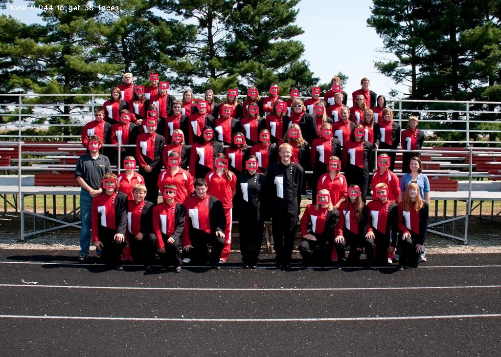

# Face detection with lightweight NN
This is an experiment with the most lightweight neural network I found in open access 
[an ultra-light model](https://github.com/Linzaer/Ultra-Light-Fast-Generic-Face-Detector-1MB) (1M ultra small model). The network operates on images of 640x480 or 320x240 pixels and outputs bounding boxes and probabilities that there is a face in that bounding box. After installing it on Nano, I achieved a speed of 25 ms (40 FPS) on average, with qualitatively good results. However, there was a significant (up to 90%) RAM and SWAP file usage, which indicates that it would be difficult to run it alongside with another algorithm (license plate detector, for this task).  
As a resume, the model is indeed lightweight, but the framework it is run with requires a lot of RAM.

### Installation on Nano
1. run `pip install -r requirements.txt`
2. Compile onnx-runtime according to instructions [here](https://github.com/microsoft/onnxruntime/issues/2684#issuecomment-568548387)

For x86 architectures, there are ready binaries for onnx-runtime, can install them via pip

### Testing 
run `python3 detect_ultra_light.py`

The script will read images from `./examples` folder and output images with faces highlighted in red to `./TestOutput`, and print inference latencies in terminal.

