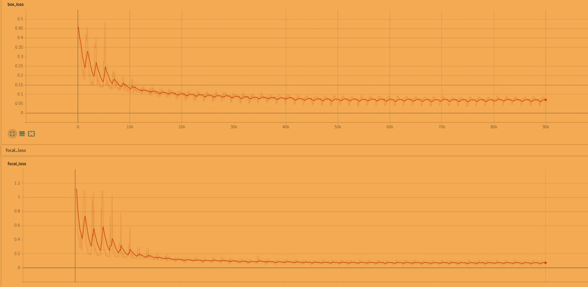

## Retinanet based on resnet-10
Similar to Detectnet experiment, Retinanet is a research project for training networks that are compatible with Deepstream applications. However, it is not claimed to be an official product of Nvidia, hence the support is mainly limited to github issues. Nevertheless, this project was used for Nvidia's [redaction app](https://github.com/NVIDIA-AI-IOT/retinanet_for_redaction_with_deepstream), indicating that it should be accurate and fast enough to produce good results in real-time on edge devices. I decided to experiment with it and compare results to Detectnet.

Retinanet architecture is a single-stage detector, and it uses a set of pre-defined anchors on the image that are corrected to match object location and classified to distinguish objects from background. By default, these anchors come in 3 aspect ratios and 3 scales. The scales can be adjusted to match the average size of objects to be detected. However, increasing the number of scales will lead to heavier computations for determining ground-truth, and non-maximum-suppression postprocessing.

In my experiments, I first used the default {4, 4* 2^(1/3), 4* 2^(2/3)} scales. After training, I found that many small objects were missed. I assumed that it might be due to large size of anchors. I tried to decrease the scales to {2, 2* 2^(1/3), 2* 2^(2/3)}. This is not configurable by any handle, so one needs to augment the source code of the library [here](https://github.com/NVIDIA/retinanet-examples/blob/TRT5/retinanet/model.py#L26) after installation (see next chapter). Decreasing anchor scale improved the performance, and smaller objects got more detections. However, most of the detections had low confidence scores (many objects from test set images got detected only at confidence cutoff of 0.3). Some objects did not get detected even with lower thresholds, and some false positives emerged already at this threshold. Based on visual comparison of results to those of Detectnet I decided to leave retinanet aside, as the time was already limited and no clear way of improvement was seen. Also, as I found out from Detectnet, resnet18 is not optimal in terms of inference speed, but it is the smallest backbone Retinanet repo as of now supports. 

### Framework deployment
I was following the instructions listed on the [Tensorrt5 branch of official repo](https://github.com/NVIDIA/retinanet-examples/tree/TRT5). 
it is recommended to mount host directories to the container in order to retain the data after shutdown

### Dataset preparation
I use the same dataset as in Detectnet experiment. However, Retinanet expects the annotations to be in COCO json format. These JSON annotations for training and validation sets are available in the same compressed archive as the images.

### Training commands
download pretrained resnet18 model from [here](https://github.com/NVIDIA/retinanet-examples/releases/tag/19.04)

The command to launch traning was as follows
```retinanet train retinanet_rn18fpn.pth --backbone ResNet18FPN \
    --images path/to/data/images --annotations path/to/data/annotations_tr.json \
    --val-images path/to/data/images --val-annotations path/to/data/annotations_val.json \
    --classes 2 --batch 8 
```

### Testing commands
evaluation on validation set:
```retinanet infer your-model.pth --images=path/to/data/images \
  --annotations  path/to/data/annotations_val.json  --resize 640 --max-size 640
```
This got me 0.5 mAP, which is not a satisfactory result, as mentioned above.

run inference on arbitrary image set and receive detection as .json
`retinanet infer model.pth --images=/data/your_images --output=detections.json`

sample results on test set can be seen in ./test_imgs

### Loss curve


### Weight links
https://drive.google.com/open?id=1zJET1KGHX61ivyVkO49izEynuck8iK9A
